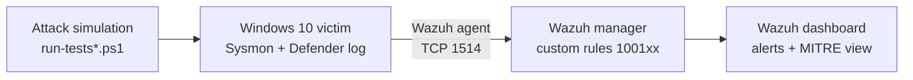

# Detection Engineering Home Lab

Hands-on SOC lab: I simulate real attacker techniques on a Windows endpoint, collect the telemetry with **Sysmon**, and write and tune my own **Wazuh** detection rules mapped to **MITRE ATT&CK**.

**Skills shown:** SIEM (Wazuh), endpoint telemetry (Sysmon), detection rule writing, MITRE ATT&CK mapping, attack simulation, log analysis, false-positive tuning, technical documentation.

## Architecture



| Component | Details |
|---|---|
| Hypervisor | Oracle VirtualBox, isolated host-only network |
| SIEM | Wazuh 4.x (manager, indexer, dashboard) on Ubuntu |
| Endpoint | Windows 10 + Sysmon (SwiftOnSecurity config) + Microsoft Defender log + Wazuh agent |

## Detections

| # | MITRE ATT&CK | Technique | Wazuh rule | Level | Result |
|---|---|---|---|---|---|
| 1 | [T1059.001](detections/T1059.001-encoded-powershell.md) | Encoded PowerShell command | 100100 + 100106 | 12 | ✅ Detected (after tuning) |
| 2 | [T1105](detections/defender-block-visibility.md) | certutil file download (LOLBin) | 100101 + built-in 62123 | 12 | 🛡️ Blocked by Defender, and the block now alerts (62123) |
| 3 | T1136.001 | Local account creation | 100102 | 10 | ✅ Detected |
| 4 | T1053.005 | Scheduled task creation | 100103 | 8 | ✅ Detected |
| 5 | T1003.001 | LSASS dump via comsvcs.dll | 100104 | 14 | ✅ Detected |
| 6 | T1070.001 | Event log clearing | 100105 | 12 | ✅ Detected |
| 7 | [T1033](detections/T1033-whoami-discovery.md) | Account discovery (`whoami /groups`) | 100107 | 6 | ✅ Detected |
| 8 | [T1069.001](detections/T1069.001-local-admin-group-discovery.md) | Local Administrators group discovery | 100108 | 8 | ✅ Detected |
| 9 | [T1547.001](detections/T1547.001-run-key-persistence.md) | Run key persistence to a user-writable folder | 100109 | 12 | ✅ Detected |

**Test run 1 (Week 2): 5 of 6 techniques detected by custom rules; the 6th was prevented by the endpoint's antivirus.**

**Test run 2 (Week 3): all 3 new techniques detected, and the antivirus block from run 1 now raises a level-12 alert. Total: 9 techniques, 8 detected by custom rules and 1 prevented and alerted.**


## Findings from testing

1. **Rule precedence matters.** The first run, rule 100100 never fired. The alert log showed the event had been claimed by Wazuh's built-in rule **92057** ("Powershell.exe spawned a powershell process which executed a base64 encoded command"). Wazuh evaluates child rules in load order and only the first match continues, so built-in rules shadow later custom rules on the same parent. **Fix:** companion rule **100106**, chained to 92057 with `<if_sid>`, so the lab's detection fires whenever the built-in one does.
2. **Prevention before detection.** The certutil download never produced a Sysmon process-creation event. `Get-MpThreatDetection` showed Microsoft Defender blocked it at launch. The rule is still useful on hosts where Defender is disabled or bypassed. **Week 3 fix:** I forwarded Defender's own event log to Wazuh ([setup/forward-defender-logs.ps1](setup/forward-defender-logs.ps1)), so the block now raises built-in alert 62123 (level 12).
3. **Validated end to end.** Each alert was confirmed in `/var/ossec/logs/alerts/alerts.json` on the manager, not just in the endpoint's logs.
4. **Silent built-in rules can be made useful.** Wazuh's rule 92300 matches every Run key change but at level 0 (no alert), because updaters write Run keys all the time. Child rule **100109** alerts only when the new entry points to a user-writable folder (`Users\Public`, `AppData`, `Temp`, `ProgramData`), which keeps the noise low and the signal high.
5. **One action, two alerts.** `net.exe` launches `net1.exe` to do the work, so rule 100108 fired twice per command. I kept both because attackers can call `net1.exe` directly, and documented the duplicate for analysts.
6. **Agent health is part of detection.** On the first Week 3 run the agent's connection to the manager broke (status *Pending*, `Server unavailable` in the agent log), and the Defender event from that run never reached Wazuh. After restarting the agent and re-running the test, the alert arrived. A disconnected agent is a blind spot, so agent-health alerts matter as much as attack alerts.

## Repository layout

```
rules/detection_lab_rules.xml   custom Wazuh rules
attacks/run-tests.ps1           Week 2 safe attack simulations (with cleanup)
attacks/run-tests-week3.ps1     Week 3 simulations: discovery, persistence, Defender visibility
setup/forward-defender-logs.ps1 adds the Defender event log to the Wazuh agent
detections/                     one write-up per detection
docs/01-lab-setup.md            how the lab was built
docs/02-deploy-and-test.md      how to deploy the rules and run the tests
docs/03-week3.md                Week 3 steps: Defender logs, new rules, tests
screenshots/                    alert evidence
```

## Roadmap

- [x] Week 1: Wazuh server, Windows victim, Sysmon, agent
- [x] Week 2: first 6 custom detections deployed and tested (5 detected, 1 prevented)
- [x] Week 3: discovery + persistence detections, Defender log forwarding (9 techniques total, all alerting)
- [ ] Week 4: correlation rule for discovery bursts, agent-disconnect alerting, MITRE coverage map, demo video

## Disclaimer

Everything here runs in an isolated lab. The attack simulations are harmless and clean up after themselves.
